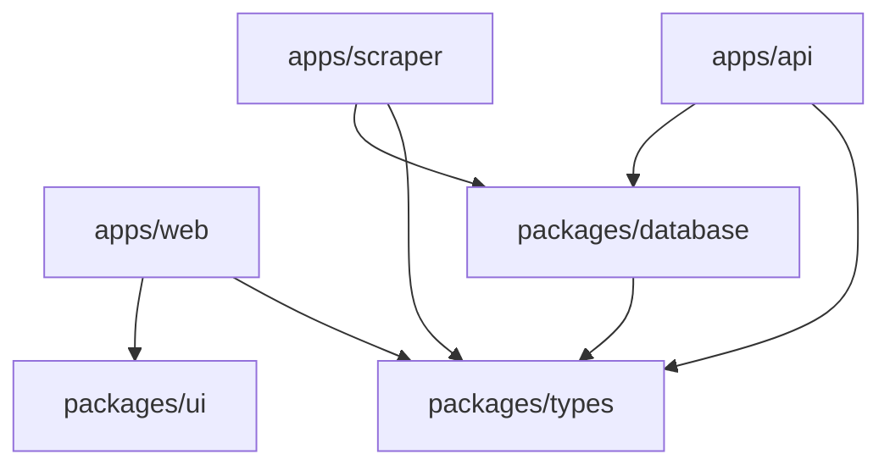

# Real Estate Aggregator MX - Project Structure & Explanation

## 🏗️ Complete Project Structure

```
real-estate-aggregator-mx/
├── apps/                           # Application workspaces
│   ├── api/                        # Express REST API
│   │   ├── src/
│   │   │   ├── controllers/        # Route handlers
│   │   │   ├── middleware/         # Express middleware
│   │   │   ├── models/            # Database models
│   │   │   ├── routes/            # API routes
│   │   │   ├── services/          # Business logic
│   │   │   ├── db/                # Database migrations
│   │   │   └── server.ts          # Entry point
│   │   ├── dist/                  # Compiled JS
│   │   ├── package.json
│   │   └── tsconfig.json
│   │
│   ├── web/                        # Next.js Frontend
│   │   ├── src/
│   │   │   ├── app/               # App router pages
│   │   │   ├── components/        # React components
│   │   │   ├── lib/               # Utilities
│   │   │   └── types/             # Local types
│   │   ├── public/                # Static assets
│   │   ├── package.json
│   │   ├── next.config.ts
│   │   └── tsconfig.json
│   │
│   └── scraper/                    # Scraping Service
│       ├── src/
│       │   ├── scrapers/          # Individual scrapers
│       │   │   ├── mercadolibre-scraper.ts
│       │   │   └── pulppo-scraper.ts
│       │   └── index.ts           # Scraper orchestrator
│       ├── package.json
│       └── tsconfig.json
│
├── packages/                       # Shared packages
│   ├── database/                   # Database utilities
│   │   ├── src/
│   │   │   └── index.ts           # Pool management
│   │   ├── package.json
│   │   └── tsconfig.json
│   │
│   ├── types/                      # Shared TypeScript types
│   │   ├── src/
│   │   │   ├── index.ts
│   │   │   ├── property.ts        # Property interfaces
│   │   │   ├── api.ts             # API types
│   │   │   └── database.ts        # DB types
│   │   ├── package.json
│   │   └── tsconfig.json
│   │
│   ├── ui/                         # Shared UI components (future)
│   │   ├── src/
│   │   ├── package.json
│   │   └── tsconfig.json
│   │
│   └── tsconfig/                   # Shared TS configs
│       ├── base.json              # Base config
│       ├── nextjs.json            # Next.js config
│       ├── node.json              # Node.js config
│       └── package.json
│
├── infrastructure/                 # Deployment & DevOps
│   ├── docker/
│   │   ├── Dockerfile.api
│   │   ├── Dockerfile.web
│   │   ├── Dockerfile.scraper
│   │   └── Dockerfile.base
│   └── scripts/                    # Utility scripts
│
├── docs/                          # Documentation (optional)
│   ├── API.md
│   ├── ARCHITECTURE.md
│   └── DEPLOYMENT.md
│
├── .github/                       # GitHub specific
│   └── workflows/                 # CI/CD pipelines
│
├── turbo.json                     # Turborepo config
├── package.json                   # Root package.json
├── docker-compose.yml             # Local dev environment
├── .env.example                   # Environment template
├── .gitignore
├── .eslintrc.json                 # ESLint config
├── .prettierrc.json              # Prettier config
├── tsconfig.json                  # Root TS config
└── README.md
```

## 📦 Package Relationships



## 🔧 How It Works

### 1. **Monorepo Management (Turborepo)**
- **Purpose**: Manages builds, caching, and task orchestration
- **Benefits**: 
  - Builds only what changed
  - Caches previous builds
  - Runs tasks in parallel
  - Manages dependencies between packages

### 2. **Workspace Structure**
- **apps/**: Self-contained applications that can be deployed
- **packages/**: Shared code used by multiple apps
- **infrastructure/**: Deployment and tooling configurations

### 3. **Shared Packages Explained**

#### @aggregator/types
```typescript
// Shared across all apps
interface Property {
  id: string;
  title: string;
  price: number;
  // ... etc
}
```
- Single source of truth for data structures
- Prevents type mismatches between frontend/backend
- Auto-completion in IDEs

#### @aggregator/database
```typescript
// Used by API and Scraper
import { initializeDatabase, query } from '@aggregator/database';
```
- Centralized database configuration
- Connection pooling
- Shared query utilities

#### @aggregator/ui (future)
```tsx
// Shared React components
import { PropertyCard, SearchBar } from '@aggregator/ui';
```
- Reusable UI components
- Consistent design system
- Reduced duplication

### 4. **Development Workflow**

```bash
# 1. Install all dependencies (root level)
npm install

# 2. Run everything in development
npm run dev

# 3. Run specific app
npm run api:dev
npm run web:dev
npm run scraper:dev

# 4. Build everything
npm run build

# 5. Type check across all packages
npm run typecheck
```

### 5. **How Changes Propagate**

When you modify a shared package:
1. Change `packages/types/src/property.ts`
2. Turborepo detects the change
3. Rebuilds only affected apps (api, web, scraper)
4. TypeScript ensures type safety everywhere

### 6. **Environment Configuration**

Each app can have its own env vars:
```
apps/api/.env.local      # API specific
apps/web/.env.local      # Frontend specific
.env                     # Shared across all
```

### 7. **Build Pipeline**

```
turbo build
  ├── packages/types (build first)
  ├── packages/database (depends on types)
  ├── apps/api (depends on types, database)
  ├── apps/web (depends on types)
  └── apps/scraper (depends on types, database)
```

## 🚀 Key Benefits

1. **Code Sharing**: Write once, use everywhere
2. **Type Safety**: Changes in types are caught at compile time
3. **Independent Deployment**: Each app can be deployed separately
4. **Faster Development**: Change detection and caching
5. **Consistent Standards**: Shared linting and formatting
6. **Scalability**: Easy to add new apps or packages

## 📝 Common Tasks

### Adding a New App
```bash
# Create new app
mkdir apps/new-app
cd apps/new-app
npm init

# Add to root package.json workspaces
# Add to turbo.json pipeline
```

### Adding a New Package
```bash
# Create new package
mkdir packages/new-package
cd packages/new-package
npm init

# Export from packages/new-package/src/index.ts
# Import in apps: import { something } from '@aggregator/new-package'
```

### Running Database Migrations
```bash
# From root
npm run db:migrate

# Or directly
cd apps/api
npm run db:migrate
```

## 🔍 Debugging Tips

1. **Build Issues**: Check `turbo.json` dependencies
2. **Type Errors**: Ensure packages are built first
3. **Import Errors**: Check `tsconfig.json` paths
4. **Cache Issues**: `npm run clean` and rebuild

## 📈 Performance Optimizations

1. **Turborepo Caching**: Automatically caches builds
2. **Parallel Execution**: Tasks run concurrently
3. **Incremental Builds**: Only rebuilds what changed
4. **Shared Dependencies**: Single node_modules at root

This structure provides a solid foundation for scaling your Real Estate Aggregator while maintaining code quality and developer experience!